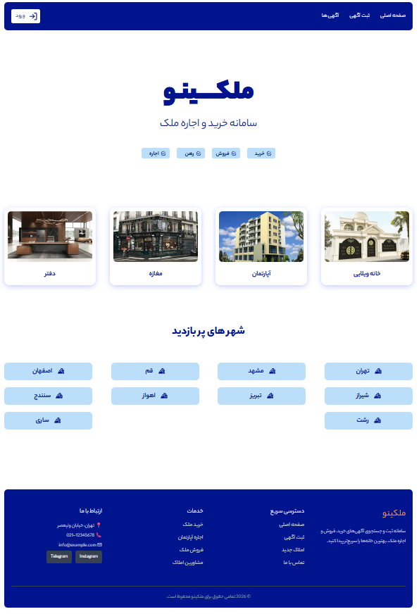

# 🏠 Ad Registration App (Real Estate Management)


An advanced Real Estate Advertisement Management System built with **Next.js**. This application allows users to browse property listings and provides a robust administrative dashboard for managing, approving, and publishing advertisements.

🚀 **[View Live Demo](YOUR_VERCEL_URL_HERE)**

---

## 📸 Preview



> *Note: This image shows the landing page where users can browse and filter properties.*

---

## ✨ Key Features

### 👤 User Features
- **Authentication:** Secure Sign-in and Sign-up flow.
- **Property Browsing:** View a wide range of real estate listings.
- **Smart Filtering:** Filter advertisements based on category/type (e.g., Apartment, Villa, Commercial).
- **Responsive Design:** Custom-built responsive layouts using **Pure CSS**.

### 🛡️ Admin Features (Management Panel)
- **Admin Dashboard:** A dedicated secure area for administrators.
- **Ad Moderation:** Review pending advertisements.
- **Approval Workflow:** Ability to approve or reject listings before they go live.
- **Content Management:** Full CRUD (Create, Read, Update, Delete) capabilities for property listings.

### ⚙️ Technical Highlights
- **Database Integration:** Robust data modeling using **Mongoose** with **MongoDB**.
- **Server-Side Rendering (SSR):** Optimized for SEO and fast initial page loads.
- **Protected Routes:** Middleware-based protection for Admin and User routes.

---

## 🛠️ Tech Stack

- **Framework:** [Next.js](https://nextjs.org/) (App Router)
- **Database:** [MongoDB](https://www.mongodb.com/)
- **ODM:** [Mongoose](https://mongoosejs.com/)
- **Styling:** [Pure CSS / CSS Modules](https://developer.mozilla.org/en-US/docs/Web/CSS)
- **Language:** [JavaScript (ES6+)](https://developer.mozilla.org/en-US/docs/Web/JavaScript)
- **Authentication:** [Mention your Auth, e.g., NextAuth.js / Clerk]
- **Deployment:** [Vercel](https://vercel.com/)

---

## 🚀 Getting Started

Follow these steps to run the project locally:

### 1. Clone the repository
```bash
git clone https://github.com/YOUR_USERNAME/ad-registration-app.git
cd ad-registration-app

### 2. Install dependencies
```bash
npm install
# or
yarn install

### 3. Set up Environment Variables
Create a `.env` file in the root directory and add your credentials. You can use the `.env.example` file as a template:
```env
NEXTAUTH_URL="http://localhost:3000"
NEXTAUTH_SECRET="your_secret_here"
MONGO_USER="your_db_username"
MONGO_PASS="your_db_password"
MONGO_URI="your_mongodb_connection_string"

### 4. Run the development server
```bash
npm run dev
Open http://localhost:3000 with your browser to see the result.
